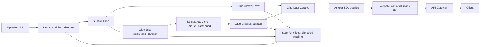
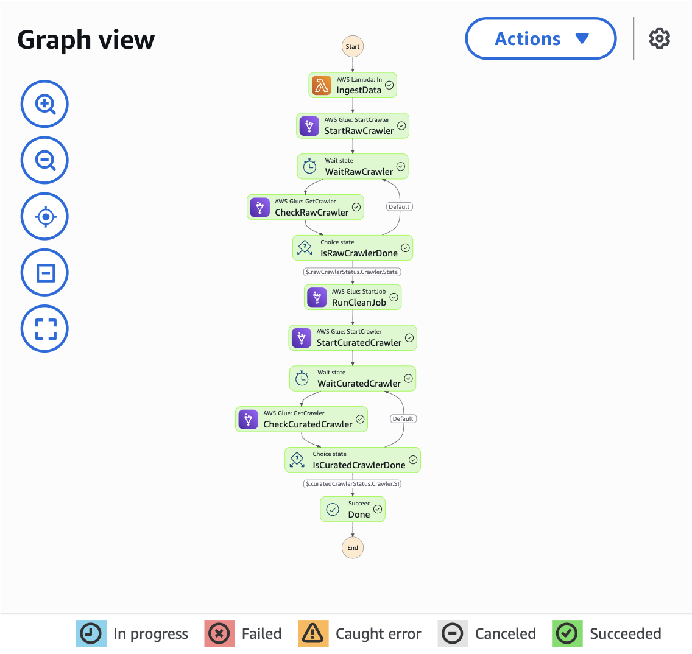

# AlphaFold Protein Metadata Lakehouse

I built this to teach myself the AWS data engineering stack I didn't get to touch 
during my ML/CV internship. It's a serverless pipeline that pulls protein 
structure metadata from the AlphaFold Database built by the team at Google DeepMind,
cleans it up, and turns it into something you can query with SQL.

## What it does

Every protein AlphaFold has a structure prediction for comes with a chunk of 
metadata, which contains confidence scores, which organism it's from, which pipeline generated 
it. This project ingests that metadata, cleans and deduplicates it, partitions 
it by organism, and makes it queryable through Athena, orchestrated end to 
end with Step Functions, requiring no servers running anywhere in between.

## How it's put together



Data flows in five stages: a Lambda function pulls metadata from the AlphaFold 
API and drops raw JSON into S3. A Glue crawler catalogs it. A Glue job cleans 
and deduplicates the records, then rewrites them as partitioned Parquet. Another 
crawler catalogs that curated layer, and Athena queries it directly. Step 
Functions chain the ingest -> clean -> catalog steps together so the whole thing 
runs off a single trigger.

## My motivations to choose this tech stack and implementations :)

**Metadata Cataloging makes it quick.** AlphaFold's full dataset is over 
23TiB across 200 million+ files and for a project to test out my new AWS knowledge it wasn't
realistic, and taking the metadata is enough for me to test out the demo at this point in time.

**Partitioning by organism.** I wanted to be able to actually show that partitioning does 
something like what I was taught at uni, see the benchmark below.

**Using Glue's Python Shell instead of PySpark.** Python Shell jobs are faster to write, 
faster to debug, I had free AWS credits to burn and I get to practice using Glue, what's not
to love about it?

## The step by step pipeline

1. **Ingest**: `alphafold-ingest` Lambda pulls metadata from the AlphaFold API 
   and writes raw JSON to S3, one file per protein and organized by organism
2. **Catalog the raw zone**: a Glue crawler registers the schema
3. **Clean and partition**: `clean_and_partition.py` dedupes on model ID, 
   drops the (fairly large) raw sequence string, derives a confidence-tier 
   column from the pLDDT breakdown, and writes everything back out as 
   partitioned Parquet
4. **Catalog the curated zone**: another crawler, now over the cleaned data
5. **Query it**: Athena runs plain SQL against the curated table
6. **Automate it**: a Step Functions state machine chains steps 1–4 so the 
   whole thing runs from a single trigger

## Results

I ingested and cleaned 4375 unique protein records from the E. coli K-12 
proteome along with some stray records from humans as a sanity check. 

| Query | Data scanned |
|---|---|
| Filtered to one organism (E. coli) | 7.71 KB |
| No filter, full table | 7.91 KB |

The gap here is small and the reason for it is because out of 4,375 total records, 
4,371 are E. coli — the other a handful of stray records  picked up from earlier development
test that I mentioned before. Filtering to E. coli doesn't prune much because E. coli is
almost the whole table. Partition pruning's value scales with how skewed and how large 
the dataset actually is. And a meaningful benchmark would need multiple organisms
ingested at comparable volume, which I'd want to do next before I can update the performance metrics of this project.

## Example queries
```
-- Total number of records
SELECT COUNT(*) AS total_records
FROM curated;
```

```
-- Creating a table that can be stored in S3 from the Query
CREATE TABLE high_confidence_summary
WITH (
  format = 'PARQUET',
  external_location = 's3://alpha-lakehouse/curated_summary/'
) AS
SELECT organism, COUNT(*) AS high_conf_count
FROM curated
WHERE confidence_tier = 'very_high'
GROUP BY organism;
```

## Graph View of the Step Functions after it finished


## Serving layer

Everything above turns raw API data into a queryable table, but a query
engine isn't a useful product or even a product at all - nobody outside this repo 
can hit "run some SQL in the Athena console" as an integration point. So there's 
a thin API in front of it: `alphafold-query-api`, an API Gateway (HTTP API) 
endpoint backed by a Lambda that runs a parameterized Athena query and hands back JSON.

It answers one specific question (as of now until I add more useful ones in here):
**which structures for a given organism have the lowest-confidence predictions?** 
That's an example of the case an actual consumer (a dashboard, another service, etc..)
would care about, instead of just expecting people to run SQL queries on a database 
they're not familiar with.

```
GET https://hehqe82epc.execute-api.ap-southeast-2.amazonaws.com/structures/lowest-confidence?organism=Escherichia_coli__strain_K12_&limit=10
```

```json
{
  "organism": "Escherichia_coli__strain_K12_",
  "count": 3,
  "results": [
    {
      "uniprot_accession": "P28697",
      "gene": "mbiA",
      "global_metric_value": "27.66",
      "confidence_tier": "low",
      "tool_used": "AlphaFold Monomer v2.0 pipeline",
      "provider_id": "GDM",
      "model_created_date": "2025-08-01 00:00:00.000"
    }
  ]
}
```

(`organism` has to match the partition value exactly — it's the sanitized
scientific name, e.g. `Escherichia_coli__strain_K12_`, `Homo_sapiens`,
`Mus_musculus`. This is deployed and live in my own AWS account at the URL above.)

`organism` is run through the same sanitizer the ingest Lambda and Glue job
already use for the partition value, so the input is guaranteed to either
match a real partition or get cleaned to something inert — that's also what
keeps the query string injection-safe without needing Athena prepared
statements. `limit` is clamped to 1–50.

Lambda code: [`lambda/query_api_function.py`](lambda/query_api_function.py).
IAM policies: [`infra/api/`](infra/api/).

**Deploying it** (same manual-CLI pattern as the rest of `infra/` — adjust
region/account for your setup):

```bash
# role
aws iam create-role --role-name alphafold-query-api-role \
  --assume-role-policy-document file://infra/api/trust-policy.json
aws iam put-role-policy --role-name alphafold-query-api-role \
  --policy-name alphafold-query-api-policy \
  --policy-document file://infra/api/permissions-policy.json
sleep 15  # IAM propagation, same common pitfall as the ingest role

# an Athena workgroup needs somewhere to put results before it'll run at all
aws s3api put-object --bucket alpha-lakehouse --key athena-results/

# package + create the function
cd lambda && zip query_api_function.zip query_api_function.py && cd ..
aws lambda create-function --function-name alphafold-query-api \
  --runtime python3.12 --handler query_api_function.handler \
  --role arn:aws:iam::<ACCOUNT_ID>:role/alphafold-query-api-role \
  --zip-file fileb://lambda/query_api_function.zip \
  --timeout 30 --memory-size 256 \
  --environment "Variables={ATHENA_DATABASE=alphafold_db,ATHENA_TABLE=curated,ATHENA_OUTPUT_LOCATION=s3://alpha-lakehouse/athena-results/,ATHENA_WORKGROUP=primary}"

# HTTP API in front of it
aws apigatewayv2 create-api --name alphafold-api --protocol-type HTTP \
  --target arn:aws:lambda:<REGION>:<ACCOUNT_ID>:function:alphafold-query-api
```

`create-api --target` auto-creates a catch-all `$default` route/stage/
integration, which is enough for a demo endpoint. The important pitfall:
because the route is `$default`, the ARN API Gateway actually invokes
Lambda with has `$default` in the route segment — *not* the literal request
path — so a permission scoped to `.../structures/lowest-confidence` won't
match and every request 500s with no Lambda invocation logged at all. Scope
it to `$default` instead (use the ApiId from the command above):

```bash
aws lambda add-permission --function-name alphafold-query-api \
  --statement-id apigw-invoke --action lambda:InvokeFunction \
  --principal apigateway.amazonaws.com \
  --source-arn "arn:aws:execute-api:<REGION>:<ACCOUNT_ID>:<API_ID>/*/\$default"
```

A real service would want an explicit route instead of catching everything
on `$default`.

## Running it yourself

You'll need an AWS account, the AWS CLI configured, and Python 3.10+. Clone the 
repo, install `requirements.txt`, then work through the commands in `infra/` 
in order — trust policies and permissions first, then deploy the Lambda and 
Glue job.

## What I'd build next
- A small Streamlit dashboard sitting on top of `alphafold-query-api` instead
  of hitting Athena directly
- EventBridge scheduling, so the pipeline refreshes on its own instead of doing it manually
- Infrastructure as code (CDK) so the whole thing is reproducible from a clean 
  AWS account
- A second partition dimension on confidence tier
- Usage-plan / API key throttling on the endpoint if it were ever public
  instead of on this portfolio demo